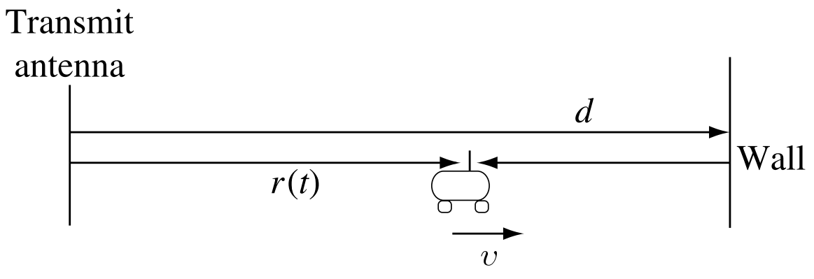

# Homework 1

## Problem 1

Show that the complex baseband channel impulse response to carrier modulated signal is given by

$C_{d,\theta}(\tau) = \displaystyle\sum_{n}\beta_n(d,\theta)e^{j\phi n^{(d,\theta)}}\delta(\tau-\tau_n)$

where $\phi_n = −2πf_c\tau_n$. (Hint: You may use the fact that the passband impulse response of a multipath channel is $h_{d,θ} (\tau ) = \displaystyle\sum_{n}\beta_n(d,\theta)\delta(\tau − \tau_n)$, and a passband carrier modulated signal s(t) relates to its baseband representation $s_b(t)$ by $s(t) = \real(s_b(t)e^{j2πf_ct})$.

We start with the given formula for the passband response:

$h_{d,θ} (\tau ) = \displaystyle\sum_{n}\beta_n(d,\theta)\delta(\tau − \tau_n)$

Our formula relating the baseband to the pass band is:

$s_b(t)$ by $s(t) = \real(s_b(t)e^{j2πf_ct})$

Then we the formula for the phase $\phi_n = -2\pi f_c \tau_n$

To go from the the $S_b(t)$ to the $S(t)$ represnetation you must modulate the signal using this formula and taking the real part of it.

$\displaystyle S_b(t) = a(t)e^{j4(t)}$ is the closed form expression

So when we modulate using $e^{j2\pi f_c t}$

$r(t) = \displaystyle\sum_{n=1}^{n(d,\theta)}\beta_n(d,\theta)S(t-\tau_n(d,\theta))$  This is the intuitive multipath carrier model that captures the effect of the multipath..

$= \displaystyle\sum_{n=1}^{n(d,\theta)}\beta_n(d,\theta)\real[S_b(t-\tau_n(d,\theta))e^{j2\pi f_c (t-\tau_n(d,\theta))}]$

Here we do some funkyness.  $\beta_n(d,\theta)$ is real valued.  We can rewrite the equation as 

$ = \displaystyle\real[\sum_{n=1}^{n(d,\theta)}\beta_n(d,\theta)e^{-j2\pi f_c (t-\tau_n(d,\theta))}S_b(t-\tau_n(d,\theta))e^{j2\pi f_c (t-\tau_n(d,\theta))}]$

In this equation, the $\beta_n(d,\theta)e^{-j2\pi f_c (t-\tau_n(d,\theta))}S_b(t-\tau_n(d,\theta))$ represents the baseband signal $r_b(t)$ and the $e^{j2\pi f_c (t-\tau_n(d,\theta))}$ is the modulation, and $e^{-j2\pi f_c (t-\tau_n(d,\theta))}$ is the phase shift.  The phase shift $e^{-j2\pi f_c (t-\tau_n(d,\theta))}$ is determined by the carrier frequency $f_c$ and the delay $\tau_n$

$C_{(d,\theta)}(\tau) = \displaystyle\sum_{n=1}^{n(d,\theta)}\beta_n(d,\theta)e^{-j2\pi f_c (t-\tau_n(d,\theta))}\delta(\tau-\tau_n(d,\theta))$

When we substtue the formula for phase shift 

$C_{(d,\theta)}(\tau) = \displaystyle\sum_{n=1}^{n(d,\theta)}\beta_n(d,\theta)e^{j\phi_n (d,\theta)}\delta(\tau-\tau_n(d,\theta))$

## Problem 2

Consider the communication from a transmitter to a mobile receiver (see textbook Fig. 2.4, page 16), where there is a single perfectly reflecting large fixed wall. The received signal at the receiver is the sum of the signal coming from the transmit antenna plus a reflected signal coming from the wall. As shown inthe figure, the distance between the transmitter and the wall is denoted by d and the distance between the transmitter and the mobile is denoted by $r$. Assume the channel gains {$βn$} associated with all paths are the same and are denoted by $β$, carrier frequency is denoted by $f_c$, and the speed of light is denoted by $c$.

### (a) Find the channel impulse response of this wireless communication system for fixed $d$ and $r$.

We see that there is no movement in the system with a fixed $d$ and $r$

We need to find $\tau$ for each of the paths.

To find out how long the singal takes to get to the mobile reciever we need to know the length and the speed.

The length is given by $r$ and the speed is the speed of light $c$
That is that $\frac{r}{c}$ is the time it taks for the line of sight signal to reach the mobile receiver.

We then need the length of the reflected path.  We get the length by looking at the d path.  The signal must first travel distance $d$ to the wall and then back to the mobile receiver which is a disatance of $d-r$.  And when you add these you get the $2d-r$.  Dividing by the speed of light to get our function we get $\displaystyle \frac{2d-r}{c}$ which is $T_{max}$

Using the channel impulse response function:

$H_{d,\theta}(f) = \displaystyle\sum_{n=1}^{n(d,\theta)}\beta_n(d,\theta)e^{-j2\pi f\tau_n(d,\theta)}$ (frequency domain)

We were told that $\beta_n$ is contant and the same for all paths.  This allows us to bring it out of the summation.

$H_{d,\theta}(f) = \displaystyle\beta\sum_{n=1}^{n(d,\theta)}e^{-j2\pi f\tau_n(d,\theta)}$

We now do the summation for the 2 paths (direct and reflected)

$H_{d,\theta}(f) = \displaystyle\beta(e^{-j2\pi f\frac{r}{c}} + e^{-j2\pi f\frac{2d-r}{c}})$

### (b) Find the delay spread of this system.

From part A we found that the delay $\tau$ for the direct path is $\frac{r}{c}$ and the delay for the reflected path is $\frac{2d-r}{c}$
This matches the formula from the book (formula 2.10) for delay spread, 

$\displaystyle T_d := T_{max} - T_{min} = \frac{2d-r}{c}-\frac{r}{c}$

### (c) Assume the mobile moves at a velocity $v$ towards the wall, Find the Doppler shift associated with each path.

In general, $\displaystyle D_{max} = f_c \frac{v}{c} = \frac{v}{\lambda_c}$ where $f_c$ is the carrier frequency, $v$ is the speed of the mobile, and $c$ is the speed of light and $D_{max}$ is the maximum doppler shift.

For the path $r(t)$ the distance is increasing so $v$ is positive.  Therefore our doppler shift is $\frac{v}{\lambda_c}$

For the reflected path, the total distance is decreasing at a rate of $-v$.  Therefore our doppler shift is $\frac{-v}{\lambda_c}$

## Problem 3

Consider the same two-path example as in problem 2 with d = 2 km and the receiver at 1.5 km from the transmitter moving at velocity 60 km/hr away from the transmitter. The carrier frequency is 900 MHz.

### (a) Plot in MATLAB the magnitudes of the taps of the discrete-time baseband channel at a fixed time t = 1. Give a few plots for several bandwidths W = 10 KHz, 100 KHz, 1 MHz, and 3 MHz so as to exhibit both flat and frequency-selective fading. As described in the book, you may assume that the path loss is given by $(r + vt)^{-1}$ for the direct path and by $(2d − r − vt)^{−1}$ for the reflected path.

TODO

### (b) Plot the time variation of the magnitude of a typical tap of the discrete-time baseband channel for a bandwidth where the channel is (approximately) flat, e.g., the 0-th tap with W = 10 KHz and for a bandwidth where the channel is frequency selective, e.g., the 5-th tap for W = 1 MHz. How does thetime-variations depend on the bandwidth? Explain. 

TODO

## Problem 4

A mobile receiver is moving at speed v and is receiving signals arriving along two reflected paths which are at angles $\theta1$ and $\theta2$ from the direction of motion. The transmitted signal is a sinusoid at frequency $f$.

### (a) Is the above information enough for estimating 1: the coherence time $T_c$ and 2: the coherence bandwidth $W_c$? If so, express in terms of the given parameters. If not, specify what additional information would be needed.

TODO

### (b) Consider an environment in which there are reflectors and scatterers in all directions from the receiver and an environment in which they are clustered within a small angular range. Using part (a), explain how the channel would differ in these two environments.

# Problem 5
Small Scale Fading. Consider the delay profile with the 13 paths, and the following parameters. The sequence of squared path gains $\alpha_0^2, \alpha_1^2,\cdots,\alpha_12^2$ is given by 

$(0.5, 0.025, 0.075, 0.1, 0.075, 0.025, 0.025, 0.075, 0.025, 0.025, 0.02, 0.02, 0.01)$

and the corresponding sequence of path delays $(\tau0, \tau1, \cdots ,\tau12)$ is given by:

$(0, 1.2, 1.4, 1.6, 1.8, 2.0, 3.4, 3.6, 3.8, 4.0, 5.2, 5.4, 5.6)\mu s$

### (a) Carefully sketch the delay profile $|h(t; \xi)|$ with the heights of the $\delta$ functions drawn approximately to scale to match the path gains.

TODO

### (b) Is there an LOS path? If so, what is the Ricean factor?

TODO

### (c) Argue that a signal with bandwidth W = 20 KHz sees the channel as a flat fading channel, and write down an expression for the pdf $p_\alpha(\alpha)$ of the effective channel gain $\alpha$.

TODO

### (d) Argue that a signal with bandwidth W = 1 MHz sees the channel as a frequency selective channel, and draw the tapped delay line model for $1 \over W$ -spaced taps.

TODO

### (e) Suppose the carrier frequency $f_c$ = 1 GHz, the mobile velocity is 60 km/hr, and the symbol rate is 105 symbols/s. Find the coherence time. Is the fading slow?

## Problem 6
Simulating Ricean flat fading. Using the direct approach we discussed in class to simulate a Ricean flat fading process with Rice factor $\kappa = 1$. Assume that the LOS component arrives at angle $\theta_0 = \pi/4$, and that the diffuse components are uniformly distributed in angle and power (isotropic). Let the total number of diffuse components be 12, and assume $f_m = 60 Hz$. 

### Plot the channel gain $|V (t)|$ in dB as a function of $t$, for $t$ ranging from 0 to 250 ms.

## Problem 7
Ricean Random Variables. Assume $X ∼ N(a, \sigma^2)$ and $Y ∼ N(b, \sigma2)$ are independent Gaussian random variables, where $a$ and $b$ are deterministic constants. Define $R$ and $\Theta$ by:

$R = \sqrt{X^2+Y^2}$, and $\Theta = \tan^-1(\frac{Y}{X})$

(Assume $\theta \in [−\pi, \pi]$.) Find the joint pdf of $R$ and $\Theta$ and from this the marginal pdf of $R$. Express the latter in term of the modified Bessel function of the first kind:

$I_0(x) = \frac{1}{2\pi} \int_{\pi}^{\pi}exp(x\cos\phi)d\phi$

The pdf of $R$ in this case is called Ricean.

TODO