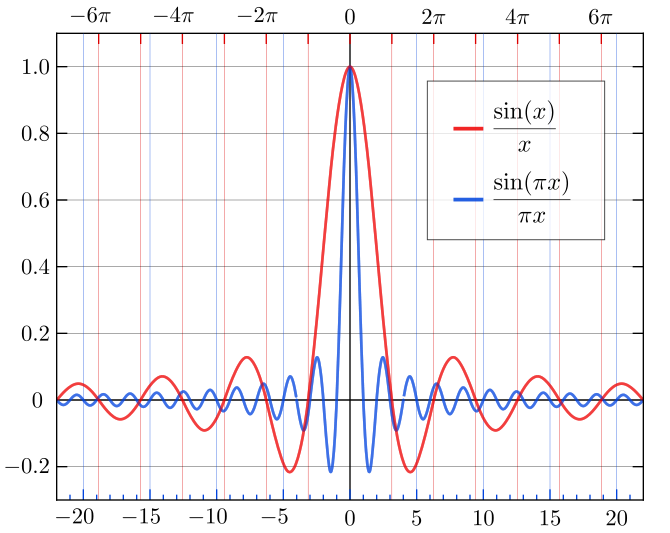
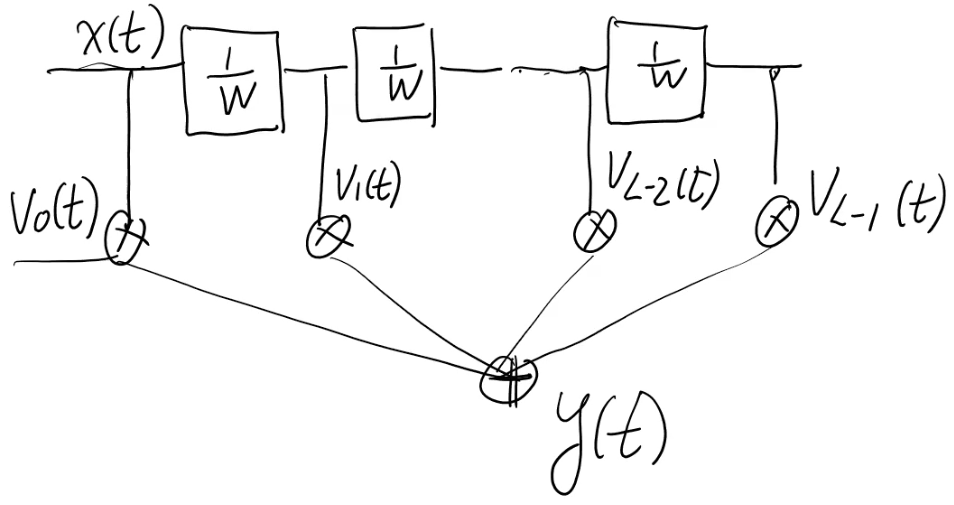
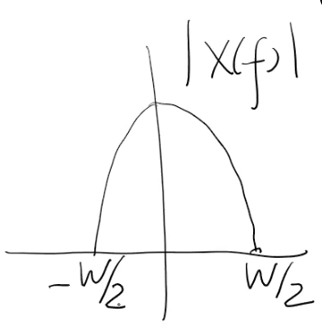
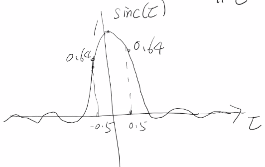
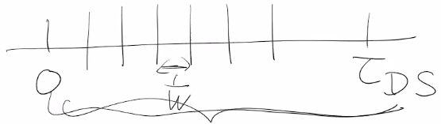

# Notes:

## Defnitions

Tap Delay Line Model
: TODO

Delay Spread
: The spread of delays in a system defined as $T_d = T_{ds} = \tau_{max} - \tau_{min}$.  This depends on the environment.  In addition, the lower the frequency, the higher the delay spread.  This is because higher frequencies attenuate more over distance.  In an urban setting a signal at 2g is in the order of a few microseconds ($\mu s$). In an indoor setting, that would be smaller on the order of a few undred of nanoseconds ($ns$)

Delay Profile
: A graph of the magnitued of the impulse responses $|h(t,\tau)|$ vs the delay $\tau$

Nyquist-Shannon sampling theorem
: The theorem states that the sample rate must be at least twice the bandwidth of the signal to avoid aliasing. In practice, it is used to select band-limiting filters to keep aliasing below an acceptable amount when an analog signal is sampled or when sample rates are changed within a digital signal processing function.

Sinc
: $\displaystyle sinc (x) = \frac{sin x}{x}$ **Unormalized Sinc Function**
: $\displaystyle sinc (\tau) = \frac{sin (\pi\tau)}{\pi\tau}$ **Unormalized Sinc Function**

##  Review.  Complex baseband impulse response.

$h(t,\tau) = \displaystyle\sum_{n=1}^{n(t)}\alpha_n(t)e^{j\phi_n(t)}\delta(\tau-\tau_n(t))$

$y(t) = \displaystyle \int_{-\inf}^{\inf}h(t,\tau)x(t-\tau)d\tau$

$\phi_n = -2\pi f_c \tau_n$

We are going to first look at the frequency flat fading case to see how that simplifies things.  Then we will go in the tap delay line channel model.

Small scale changes to movement on the order of a few wavelengths $\lambda_c$.  In this case, $N(d,\theta), \beta_n(d,\theta), \tau_n(d,\theta) \approx constant$.  But this gets multiplied by $f_c$ so the phase $\phi_n$ can change significantly.  $\therefore h_b(\tau)$ can change significantly even with small scale changes.

**NOTE: From now on we are just considering the baseband channel impulse response.**

For the following graph, the x axis is $\tau$ and the y axis is the magnitude of the impulse response $|h(t,\tau)|$.  This is a delay profile.  Often times these delay profiles wil have a clustered structure.  This is due to reflectors reflecting with many different delays. 

A big magnitue at $\tau = 0$ indicates a line of sight.

The book uses $T_d$ for delay spread.  The instructor is going to use $\tau_{DS}$  Delay spread is the longest delay minuse the minimum delay. $T_d = \tau_{DS} = \tau_{max} - \tau_{min}$

Typical delay spread for 4G LTE was microseconds.  The underwater channel was much slower (milliseconds).

$y(t) = \displaystyle \int_{-\inf}^{\inf}h(t,\tau)x(t-\tau)d\tau$

Now we are going to simplify this. We kind of shift everything over.

$y(t) = \displaystyle \int_{0}^{\tau_{DS}}h(t,\tau)x(t-\tau)d\tau$

Now we make some assumptions.  We will consider the frequency flat case.  If $x(t) \approx constant$ over the duration $[0,\tau_{DS}]$  That means that it no longer varies with $\tau$, and can thusly be pulled outside the integral.

$y(t) \approx \displaystyle x(t)\int_{0}^{\tau_{DS}}h(t,\tau)d\tau$

We are going to call the remaining integral $\displaystyle \int_{0}^{\tau_{DS}}h(t,\tau)d\tau = V_0(t)$

$y(t) \approx \displaystyle x(t) V_0(t)$ (frequency flat multiplicative relationship)

Assume a symbol duration of $T_s$.  (in the time domain) If the $T_s \gg \tau_{DS}$, then the time delay shift wont cause much harm to the signal. 

In the frequency domain if $\frac{1}{T_s} \ll \frac{1}{\tau_{DS}}$, then the time delay shift won cause much harm to the signal.  (Reminder that the bandwidth $W$ is the $\frac{1}{T_s}$ and $\frac{1}{\tau_{DS}}$ roughly gives you the coherence bandwidth)  Therefore $W \ll W_c$

$y(t) = x(T)\cdot V_0(t)$

$V_0(t) = \displaystyle \int_0^{\tau_{DS}} \sum_n \alpha_n e^{j\phi_n(t)} \delta(\tau-\tau_n) d\tau$

Remember that the integration of a delta is 1.  Next we rearange.  That is $\displaystyle \int_0^{\tau_{DS}}  \delta(\tau-\tau_n) d\tau = 1$

$V_0(t) = \displaystyle \sum_n \alpha_n e^{j\phi_n(t)} \int_0^{\tau_{DS}}  \delta(\tau-\tau_n) d\tau$

$V_0(t) = \displaystyle \sum_n \alpha_n e^{j\phi_n(t)}$
This is a single tap.

$y(t) = x(T)\cdot V_0(t)$ is a one-tap channel.  All the paths contribute to the same tap.

-------

Most of the time we are not going to have a frequency flat channel.  Instead it will be a channel with frequency selective fading.  That means we will need multiple taps.  

$L = Number\space of\space Taps$

**Tapped Delay Line Model**
$y(t) = \displaystyle \sum_{l=0}^{L-1} x(t-\frac{l}{W}) V_l(t)$

$\displaystyle\frac{1}{W} = resolution$ 

Now We want to see which paths correspond to witch taps, and how do we determine the V function for each taps.  Also how to we determine the number of taps.

This is the forier domain image of the transmitted signal.

Assume we have a signal $|x(f)|$ with Bandwidth $W$.

The Nyquist theorem specifies that a sinuisoidal function in time or distance can be regenerated with no loss of information as long as it is sampled at a frequency greater than or equal to twice per cycle.

**Iterpolation formula**
$x(\tau) = \displaystyle \sum_{l=-\infin}^{\infin} x(lT)sinc(\frac{\tau-lT}{T})$

$T = \frac{1}{W}$

Now we derive the interpolation formula to get the tap delay line formula.

We are going to rewrite $x(t)$ as $x(t-\tau)$ where $t$ is a fixed constant, and we are sampling the $\tau$

$\displaystyle lT = l \cdot\frac{1}{W} = \frac{l}{W}$

$x(t-\tau) = \displaystyle \sum_{l=-\infin}^{\infin} x(t-\frac{l}{W}) sinc(W(\tau-\frac{l}{W}))$

Now we substitue $x(t-\tau)$ into the filtering formula.

$y(t) = \displaystyle \int_{0}^{\tau_{DS}}h(t,\tau)\sum_{l=-\infin}^{\infin} x(t-\frac{l}{W}) sinc(W(\tau-\frac{l}{W}))   d\tau$
Now we do more subsitution for $h(t,\tau)$ from the fomula above:

$h(t,\tau) = \displaystyle\sum_{n=1}^{n(t)}\alpha_n(t)e^{j\phi_n(t)}\delta(\tau-\tau_n(t))$

This gives

$y(t) = \displaystyle \int_{0}^{\tau_{DS}}\displaystyle\sum_{n=1}^{n(t)}\alpha_n(t)e^{j\phi_n(t)}\delta(\tau-\tau_n(t))\sum_{l=-\infin}^{\infin} x(t-\frac{l}{W}) sinc(W(\tau-\frac{l}{W}))   d\tau$

Now we rearrange

$y(t) = \displaystyle \sum_{l=-\infin}^{\infin} x(t-\frac{l}{W}) \sum_{n=1}^{n(t)}\alpha_n(t)e^{j\phi_n(t)} \int_{0}^{\tau_{DS}} \delta(\tau-\tau_n(t)) sinc(W(\tau-\frac{l}{W})) d\tau$

Now we simplify the integral.

If we have $\displaystyle \int_0^{\tau_{DS}} \delta(\tau-\tau_n)\cdot f(\tau) d\tau$ we can replace $\delta(\tau-\tau_n)\cdot f(\tau)$ with $\delta(\tau-\tau_n)\cdot f(\tau_n )$

Then we can bring out the $f(\tau_n)$ function out of the integral because $\tau_n$ is at a specific N and is constant.

Using this back on our main function we evaluate the sinc fuction at $\tau_n$, then the integral evaluates to 1.

$y(t) = \displaystyle \sum_{l=-\infin}^{\infin} x(t-\frac{l}{W}) \sum_{n=1}^{n(t)}\alpha_n(t)e^{j\phi_n(t)} sinc(W(\tau_n-\frac{l}{W}))$

The second sum is the $V_l(t)$ tap.

$V_l(t) = \displaystyle \sum_{n=1}^{n(t)}\alpha_n(t)e^{j\phi_n(t)} sinc(W(\tau_n-\frac{l}{W}))$

Do all the paths contribute equally to each tap or not?  For the frequency flat case, all the paths aggregate together to affect $V_0$. For the frequency selective case, we need to look ath the sum in the $V_l(t)$ formula.  It is a summation of $n$.  Therfore all of the paths seem like they contribute equally to the nth path.  But think of the sinc term in the summation.  Think of each path.  $\tau_n$ is the delay for that path.  And your looking at a particular tap $L$ so $L$ is given.  If $\tau_n$(t) is pretty far away from that particular $\frac{l}{W}$ then that path is not going to contribute much to the path.  That is because the sinc function decays as it goes out on eather side. 

If $\tau_n$(t) is pretty close to that particular $\frac{l}{W}$ then that path is going to be the major contributerto the path.  The sinc mask is going to peak the contributing paths for you.

We use the following formula for deciding if a path contributes

$\displaystyle -\frac{1}{2} < W(\tau_n(t)-\frac{l}{W}) < \frac{1}{2}$

Under this condition, path $n$ contributes significantly to tap $l$.

Lets simplify the $W(\tau_n(t)-\frac{l}{W})$ term by dividing W by both (all) sides.

$\displaystyle -\frac{1}{2W} < \tau_n(t)-\frac{l}{W} < \frac{1}{2W}$

Then we can simplify further by adding $\frac{l}{W}$ to each (all) sides.

$\displaystyle \frac{l}{W}-\frac{1}{2W} < \tau_n(t) < \frac{l}{W}+\frac{1}{2W}$

To restate, The nth path contributes most significantly to the lth tap if it's delay $\tau_n$ falls into the window of 
$\displaystyle [\frac{l}{W}-\frac{1}{2W}, \frac{l}{W}+\frac{1}{2W}]$
Paths that contribute significantly to $V_l(t)$ are the ones that the sinc mask picks out.

Think about $\frac{1}{W}$ as the time domain resolution.

We need a certain number of taps spaced $\frac{1}{W}$ apart between 0 and $\tau$.  The nubmer of taps $L$ that we need can be given by the formula:

$\displaystyle L = \lceil\frac{\tau_{DS}}{\frac{1}{W}}\rceil = \lceil W \cdot \tau_{DS}\rceil$

For example, remember IS-95 CDMA (2G) where $W=1.25MHZ$ (a frequency selective wide band channel) and $\tau_{DS} = 13\mu s$ 
$\displaystyle L = \lceil W \cdot \tau_{DS}\rceil = \lceil 1.25MHZ \cdot 13\mu \rceil = 13  taps$

Another example, the underwater channel.  The $\tau_{DS} = 25ms$ and $W = 8Khz$
$\displaystyle L = \lceil W \cdot \tau_{DS}\rceil = \lceil 8KHZ \cdot 25ms \rceil = 200  taps$

Though we don't necessarily use the tap delay line model in newer carrier types, it is still beneficial because it does a good job of estimating and doesn't require a lot of parameters.  Doing it in the frequency domain wold require alot more info.

----

If you look at one tap $V_l(t)$, will that change over time.  Specifically we are talking about tap variation.  Will that tap be consistent with what you think it should be.  Recall the formula

$V_l(t) = \displaystyle \sum_{n=1}^{n(t)}\alpha_n(t)e^{j\phi_n(t)} sinc(W(\tau_n-\frac{l}{W}))$

The sync part won't change much, but what will change is the $\phi_n(t)$.  Recall:

$\phi_n(t) = -2\pi f_c \tau_n(t)$

This is related to doppler.  Because the receiver is moving, the $\tau_n$ is changing over time in the small scale, that gets amplified by the $f_c$ term for significant changes.  This is a frequency shift because the phase is changing.

Frequency Shift $ = \displaystyle\frac{\phi_n(t-\Delta t) - \phi_n(t)}{(\Delta t)(2\pi)}$  (note we wanted the frequency in Hz which is why we times the denominator by $2\pi$)

Continued on next lecture.

