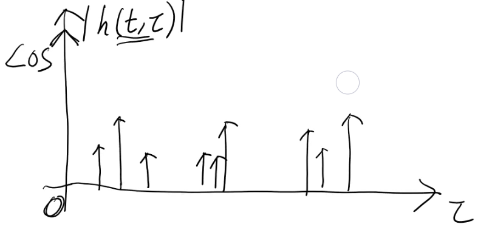

# Notes:

## Defnitions

Tap Delay Line Model
: TODO

Delay Spread
: The spread of delays in a system defined as $T_d = T_{ds} = \tau_{max} - \tau_{min}$.  This depends on the environment.  In addition, the lower the frequency, the higher the delay spread.  This is because higher frequencies attenuate more over distance.  In an urban setting a signal at 2g is in the order of a few microseconds ($\mu s$). In an indoor setting, that would be smaller on the order of a few undred of nanoseconds ($ns$)

Delay Profile
: A graph of the magnitued of the impulse responses $|h(t,\tau)|$ vs the delay $\tau$

##  Review.  Complex baseband impulse response.

$h(t,\tau) = \displaystyle\sum_{n=1}^{n(t)}\alpha_n(t)e^{j\phi_n(t)}\delta(\tau-\tau_n(t))$

$y(t) = \displaystyle \int_{-\inf}^{\inf}h(t,\tau)x(t-\tau)d\tau$

$\phi_n = -2\pi f_c \tau_n$

We are going to first look at the frequency flat fading case to see how that simplifies things.  Then we will go in the tap delay line channel model.

Small scale changes to movement on the order of a few wavelengths $\lambda_c$.  In this case, $N(d,\theta), \beta_n(d,\theta), \tau_n(d,\theta) \approx constant$.  But this gets multiplied by $f_c$ so the phase $\phi_n$ can change significantly.  $\therefore h_b(\tau)$ can change significantly even with small scale changes.

**NOTE: From now on we are just considering the baseband channel impulse response.**

For the following graph, the x axis is $\tau$ and the y axis is the magnitude of the impulse response $|h(t,\tau)|$.  This is a delay profile.  Often times these delay profiles wil have a clustered structure.  This is due to reflectors reflecting with many different delays. 

A big magnitue at $\tau = 0$ indicates a line of sight.

The book uses $T_d$ for delay spread.  The instructor is going to use $\tau_{DS}$  Delay spread is the longest delay minuse the minimum delay. $T_d = \tau_{DS} = \tau_{max} - \tau_{min}$

Typical delay spread for 4G LTE was microseconds.  The underwater channel was much slower (milliseconds).

$y(t) = \displaystyle \int_{-\inf}^{\inf}h(t,\tau)x(t-\tau)d\tau$

Now we are going to simplify this. We kind of shift everything over.

$y(t) = \displaystyle \int_{0}^{\tau_{DS}}h(t,\tau)x(t-\tau)d\tau$

Now we make some assumptions.  We will consider the frequency flat case.  If $x(t) \approx constant$ over the duration $[0,\tau_{DS}]$  That means that it no longer varies with $\tau$, and can thusly be pulled outside the integral.

$y(t) \approx \displaystyle x(t)\int_{0}^{\tau_{DS}}h(t,\tau)d\tau$

We are going to call the remaining integral $\displaystyle \int_{0}^{\tau_{DS}}h(t,\tau)d\tau = V_0(t)$

$y(t) \approx \displaystyle x(t) V_0(t)$ (frequency flat multiplicative relationship)

Assume a symbol duration of $T_s$.  (in the time domain) If the $T_s \gg \tau_{DS}$, then the time delay shift wont cause much harm to the signal. 

In the frequency domain if $\frac{1}{T_s} \ll \frac{1}{\tau_{DS}}$, then the time delay shift won cause much harm to the signal.  (Reminder that the bandwidth $W$ is the $\frac{1}{T_s}$ and $\frac{1}{\tau_{DS}}$ roughly gives you the coherence bandwidth)  Therefore $W \ll W_c$

Left off around 22:00

