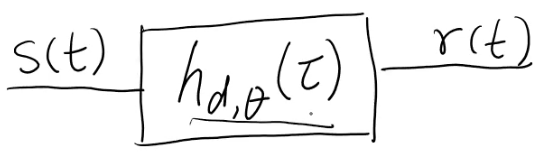
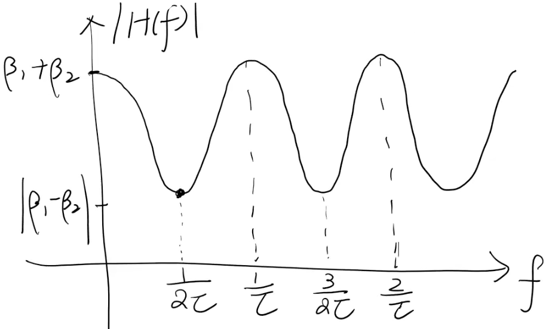
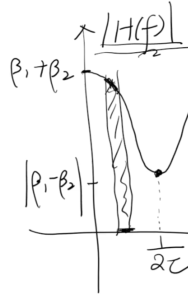

# Notes:

## Definitions

OFDMA
: Orthogonal Frequency Division Multiple Access

MIMO
: Multiple Input and Multiple Output

Beamforming
: Beamforming is a technique used in MIMO to improve the signal-to-noise ratio of received signals, eliminate undesirable interference sources, and focus transmitted signals to specific locations. To change the directionality of the array when transmitting, a beamformer controls the phase and relative amplitude of the signal at each transmitter, in order to create a pattern of constructive and destructive interference in the wavefront.

Signal Bandwidth
: $W$

Delay Spread
: TODO

Coherence Bandwidth
: TODO

Frequency Flat Fading
: TODO

Frequency Selective Fading
: TODO

Fast Fading
: TODO

Slow Fading
: TODO

Doppler
: TODO

Passband
: TODO

Baseband
: TODO

Impulse Response
: the output of a system when presented with a brief input signal called an impulse

Channel Impulse Response
: the output of a channel when presented with a brief input signal called an impulse

Multipath
: a signal that arrives at the mobile user through multiple paths  (signal reflecting off of things)

## Wireless modes

| Generation  | Year   | Bandwidth      | technology           | Notes |
| ----------- | ------ | -------------- | -------------------- | ---------- |
| 1G          | 1980   | 30K            | Analog               | Voice Only | 
| 2G          | 1990   | 30K - 1.25M    | Digital              | Voice and low rate. IS-95 CDMA.  IS-136 TDMA | 
| 3G          | 2000   | 3mbps          | Digital              | Wideband.  CDMA2000. | 
| 4G LTE      | 2010   | 100-300Mbps    | Digital              | Verizon operates at 700M, 800M, 1.7/1.9/2.1G.  Channel bandwidth 5M, 1M, 15M or 20Mhz.  MIMO - OFDMA multiplexing. | 
| 5G          | 2020   | 100-300Mbps    | Digital              | Operates at low-band (850M/1.7-2.1G), mid-band(2.4-4G)(c-band 3.7G-3.9G), and high band 24-47Ghz | 

## Channel Modeling

$\tau$ is delay
$\tau_n$ is the delay of the nth path.

A channel between a mobile receiver and a base station is modeled as a multi-path, multiple-antenna channel.  This is typically described by a channel matrix.

To start you model the basic problem using a single antenna.

Goal is to characterize the channel in terms of the channel impulse reponse.

At the mobile reciever location at $(d,\theta)$ the received signal is:

$r(t) = \displaystyle\sum_{n=1}^{n(d,\theta)}\beta_n(d,\theta)S(t-\tau_n(d,\theta))$ 

where $s(t)$ is the tramitted signal at time $t$ and
$n(d,\theta)$ is the numer of paths between the base station and the mobile receiver.
$\tau_n(d,\theta)$ is the time delay of the nth path.
Therefore $S(t-\tau_n(d,\theta))$ is the signal minus the time delay
$\beta_n(d,\theta)$ is the path gain of the nth path (attenuation)
$r(t)$ is the recieved signal at the mobile receiver.

All of the copies of the signal can add together constructively or destructively.

It can be modeled as a filter where $s(t)$ is the tramitted signal at time $t$ and $r(t)$ is the recieved signal at the mobile receiver and $h_{d,\theta}(\tau)$ is the impulse reponse$

$r(t) = \displaystyle\int_{inf}^{inf}h_{d,\theta}(\tau)S(t-\tau)d\tau$

where 
$h_{d,\theta}(\tau) = \displaystyle\sum_{n=1}^{n(d,\theta)}\beta_n(d,\theta)\delta(\tau-\tau_n(d,\theta))$ is the impulse response

If you take a delta function $\delta(t-t_0)$ where $t_0$ is a time delay and convolve it with $f(t)$ you get $\delta(t-t_0) * f(t) = f(t-t_0)$ which is a delayed copy of the function.  By this property you can get 

$(h_{d,\theta}*S)(t) = \displaystyle\sum_{n=1}^{n(d,\theta)}\beta_n(d,\theta)S(t-\tau_n(d,\theta))$

The channel impulse reponse is nothing but a sumation of delta.

When analyzing a signal you can look at it in the time domain $h(d,\theta)(\tau)$ or the frequency domain $H(d,\theta)(f)$.
$h_{d,\theta}(\tau)$ is in the time domain.

To go from this to the frequency domain we take the foruier transform.

NOTE: The Fourier transform of a delta fuction is 1.

but $\delta(\tau-\tau_n(d,\theta))$ has a delay.  Therefore we must apply the time shift property which gives us a linear phase shift which shows up as:

$\displaystyle e^{-j2\pi f\tau_n(d,\theta)}$
Where $f$ is the frequency

Therefore our original function in the time domain:

$h_{d,\theta}(\tau) = \displaystyle\sum_{n=1}^{n(d,\theta)}\beta_n(d,\theta)\delta(\tau-\tau_n(d,\theta))$

becomes

$H_{d,\theta}(f) = \displaystyle\sum_{n=1}^{n(d,\theta)}\beta_n(d,\theta)e^{-j2\pi f\tau_n(d,\theta)}$

-----------------------------------------

NOTE: from here on out, we are dropping the subscript $(d,\theta)$ for compactness.

We will begin analysis using these using a simple 2 path model.

Using some simplification here:
$\beta_1(d,\theta) = \beta_1$ is the path gane of the 1st path and 
$\beta_2(d,\theta) = \beta_2$ is the path gane of the 2nd.

Assuming the first path has a delay of 0 $\tau_1 = 0$ (Line of sight)
We will then assume the 2nd path has a delay of $\tau$  $\therefore \tau_2 = \tau$

The time delay impulse reponse for this example is

$h(t) = \beta_1\delta(t) + \beta_2\delta(t-\tau)$
And again in the frequency domain
$H(f) = \beta_1 + \beta_2\displaystyle e^{-j2\pi f\tau}$  
Remember here that the first delta function became one because the Fourier transform of a funciton is 1.

Now we are going to assume that $\tau$ is fixed.  (there is no movement in the system)

Lets look at how the frequency reponse $H(f)$ varies with frequency.  We are going to look at the magnitude of 

$H(f) = \beta_1 + \beta_2\displaystyle e^{-j2\pi f\tau}$
Which becomes
$|H(f)| = |\beta_1 + \beta_2cos(2\pi f\tau) - \beta_2sin(2\pi f\tau)|$  
The $\beta_1 + \beta_2cos(2\pi f\tau)$ is the real part and $\beta_2sin(2\pi f\tau)$ is the imaginary part.

Using the hypotenuse formula $ c = \sqrt{a^2 + b^2}$ and FOILing $\beta_1 + \beta_2cos(2\pi f\tau)$ we get

$|H(f)| = \sqrt{\beta_1^2 + 2\beta_1\beta_2cos2\pi f\tau + \beta_2^2cos^2(2\pi f\tau) + \beta_2^2sin^2(2\pi f\tau)}$  

Since $x(cos^2y) + x(sin^2y) = x$ we can simplify the final 2 terms.

$|H(f)| = \sqrt{\beta_1^2 + 2\beta_1\beta_2cos2\pi f\tau + \beta_2^2}$  
Keep in mind we are still looking at the magnitude of the frequency response.
In the following diagram we are ploting from where cos is 1 to where cos is -1.

We get the first minimum value when $2\pi f\tau = \pi$  Solving this for $f$ we get $f = \frac{1}{2\tau}$

From this we can see that if we are transmitting a signal with a very large bandwidth then our $f$ wil cover a large range.  This will cause the different frequency components of our signal to have different attenuation which will cause distortion.  This would give us a frequency selective tap.

If however, we chose a bandwidth that has a very narrow frequency range, we can think of the bandwidth as being aproximately constant.  Over this narrow channel it would give us a frequency flat channel with no distortion.

Therefore if the signal bandwidth $W \ll \frac{1}{\tau}$ it can be treated as a a frequency flat channel (we will see constant amplitude fluctuation)

If the $W \gg \frac{1}{\tau}$ then we will see severe frequency distortion and will see frequency selective fading.

