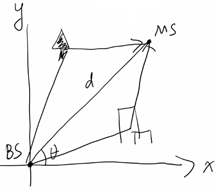
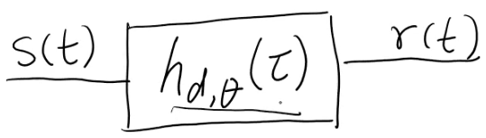
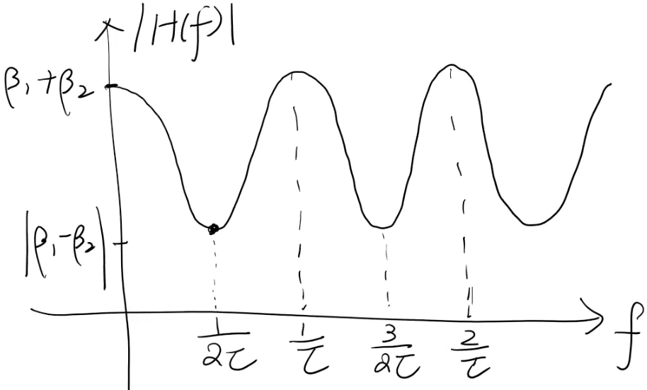
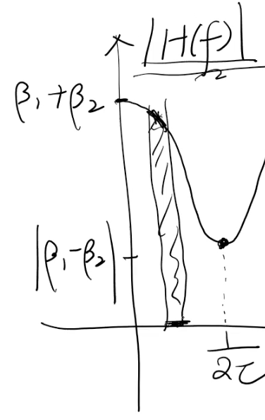
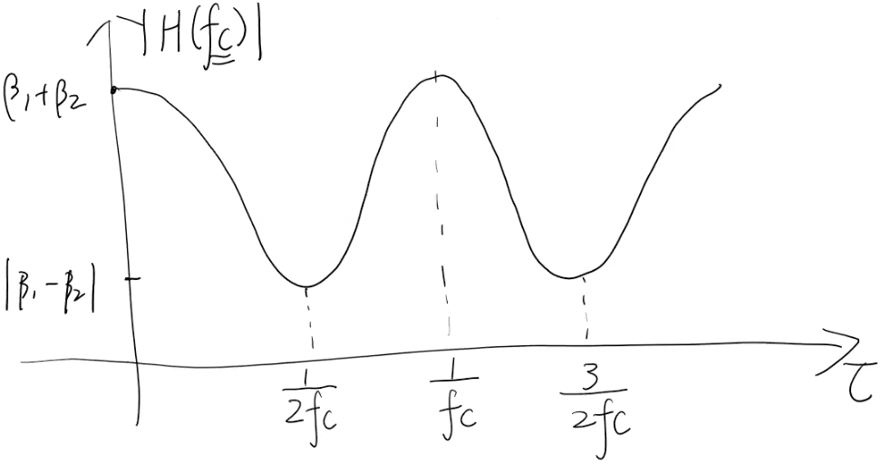
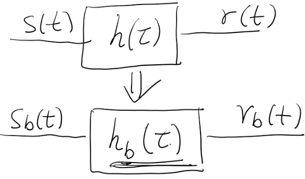
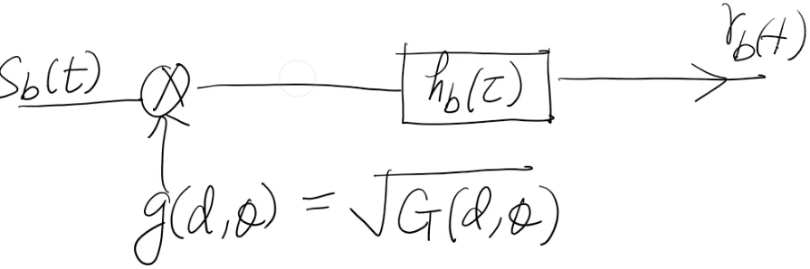

# Notes:

## Definitions

MIMO
: Multiple Input and Multiple Output

Beamforming
: Beamforming is a technique used in MIMO to improve the signal-to-noise ratio of received signals, eliminate undesirable interference sources, and focus transmitted signals to specific locations. To change the directionality of the array when transmitting, a beamformer controls the phase and relative amplitude of the signal at each transmitter, in order to create a pattern of constructive and destructive interference in the wavefront.

Signal Bandwidth
: $W$

Delay
: $\tau$ The time it takes for a signal to travel from a to b.

Carrier Frequency
: $f_c$

Delay Spread
: The spread of delays in a system defined as $T_d = T_{ds} = \tau_{max} - \tau_{min}$.  This depends on the environment.  In addition, the lower the frequency, the higher the delay spread.  This is because higher frequencies attenuate more over distance.  In an urban setting a signal at 2g is in the order of a few microseconds ($\mu s$). In an indoor setting, that would be smaller on the order of a few undred of nanoseconds ($ns$)

Carrier Frequency
: $f_c$

Coherence Bandwidth
: $W_c \approx \frac{1}{t_d}$  Indoor settings will give a larger cohererence bandwidth.  Sometime this is timed by a constand less than zero to get a tighter channel.  Usually in the order of a couple of hundred hertz.

Frequency Flat
: This refers to a signal where the channel bandwidth is small enough that the amplitude is approximately constant across it's frequency range.  

Frequency Selective
: This refers to a signal where the channel bandwidth is large enough that you get variations in amplitude over it's frequency range.

Coherence Time
: $T_c$ The timescale over which time your channel is roughly the same. $T_c \approx \frac{1}{f_m}$.  Often this is multiplied by 0.1 constant.

Fast Fading
: Fast fading is where your channel changes significantly during the duration of a symbol.

Slow Fading
: Slow fading is where your channel doesn't change during the duration of a symbol.

Doppler
: A change in the received frequency due to movement in the system.

Baseband
: A signal that can be sent to the receiver without any frequency shifting.  

Passband
: A signal that must first be shifted to a higher frequency for transmission.  The receiver will have to shift the frequency back to the original frequency for processing

Impulse Response
: the output of a system when presented with a brief input signal called an impulse

Channel Impulse Response
: the output of a channel when presented with a brief input signal called an impulse

Multipath
: a signal that arrives at the mobile user through multiple paths  (signal reflecting off of things)

OFDMA
: Orthogonal Frequency Division Multiple Access.  Bandwidth used is wide. 1 - 2 Mhz.  This bandwidth is divided into smaller channels 

Maximum Dopper Shift
: $\displaystyle f_m = f_c \frac{v}{c} = \frac{v}{\lambda_c}$ where $f_c$ is the carrier frequency, $v$ is the speed of the mobile, and $c$ is the speed of light.

Phase Shift
: $\phi_n = -2\pi f_c \tau_n$

Small Scale Variation
: Refers to movement on the order of a few wavelengths $\lambda_c$.  In this case, $N(d,\theta), \beta_n(d,\theta), \tau_n(d,\theta) \approx constant$.
: But this gets multiplied by $f_c$ so the phase $\phi_n$ can change significantly.  
: Will be the focus of this class.

Large Scale Variation
: Refers to movement of orders $\gg \lambda_c$  This results in significant chagnes in $N(d,\theta), \beta_n(d,\theta), \tau_n(d,\theta)$.  Usually taken care of by doing things like power control.
: Will be mostly ignored in this class.

Average Channel Power Gain
: $G(d,\theta) = \displaystyle\sum_{n=1}^{n(d,\theta)}\beta_n^2(d,\theta)$

## Wireless modes

| Generation  | Year   | Bandwidth      | technology           | Notes |
| ----------- | ------ | -------------- | -------------------- | ---------- |
| 1G          | 1980   | 30K            | Analog               | Voice Only | 
| 2G          | 1990   | 30K - 1.25M    | Digital              | Voice and low rate. IS-95 CDMA.  IS-136 TDMA | 
| 3G          | 2000   | 3mbps          | Digital              | Wideband.  CDMA2000. | 
| 4G LTE      | 2010   | 100-300Mbps    | Digital              | Verizon operates at 700M, 800M, 1.7/1.9/2.1G.  Channel bandwidth 5M, 1M, 15M or 20Mhz.  MIMO - OFDMA multiplexing. | 
| 5G          | 2020   | 100-300Mbps    | Digital              | Operates at low-band (850M/1.7-2.1G), mid-band(2.4-4G)(c-band 3.7G-3.9G), and high band 24-47Ghz | 

## Channel Modeling

$\tau$ is delay
$\tau_n$ is the delay of the nth path.

A channel between a mobile receiver and a base station is modeled as a multi-path, multiple-antenna channel.  This is typically described by a channel matrix.

To start you model the basic problem using a single antenna.

Goal is to characterize the channel in terms of the channel impulse reponse.

At the mobile reciever location at $(d,\theta)$ the received signal is:

$r(t) = \displaystyle\sum_{n=1}^{n(d,\theta)}\beta_n(d,\theta)S(t-\tau_n(d,\theta))$ 

where $s(t)$ is the tramitted signal at time $t$ and
$n(d,\theta)$ is the numer of paths between the base station and the mobile receiver.
$\tau_n(d,\theta)$ is the time delay of the nth path.
Therefore $S(t-\tau_n(d,\theta))$ is the signal minus the time delay
$\beta_n(d,\theta)$ is the path gain of the nth path (attenuation)
$r(t)$ is the recieved signal at the mobile receiver.

All of the copies of the signal can add together constructively or destructively.

It can be modeled as a filter where $s(t)$ is the tramitted signal at time $t$ and $r(t)$ is the recieved signal at the mobile receiver and $h_{d,\theta}(\tau)$ is the impulse reponse$

$r(t) = \displaystyle\int_{inf}^{inf}h_{d,\theta}(\tau)S(t-\tau)d\tau$

where 
$h_{d,\theta}(\tau) = \displaystyle\sum_{n=1}^{n(d,\theta)}\beta_n(d,\theta)\delta(\tau-\tau_n(d,\theta))$ is the impulse response

If you take a delta function $\delta(t-t_0)$ where $t_0$ is a time delay and convolve it with $f(t)$ you get $\delta(t-t_0) * f(t) = f(t-t_0)$ which is a delayed copy of the function.  By this property you can get 

$(h_{d,\theta}*S)(t) = \displaystyle\sum_{n=1}^{n(d,\theta)}\beta_n(d,\theta)S(t-\tau_n(d,\theta))$

The channel impulse reponse is nothing but a sumation of delta.

When analyzing a signal you can look at it in the time domain $h(d,\theta)(\tau)$ or the frequency domain $H(d,\theta)(f)$.
$h_{d,\theta}(\tau)$ is in the time domain.

To go from this to the frequency domain we take the foruier transform.

NOTE: The Fourier transform of a delta fuction is 1.

but $\delta(\tau-\tau_n(d,\theta))$ has a delay.  Therefore we must apply the time shift property which gives us a linear phase shift which shows up as:

$\displaystyle e^{-j2\pi f\tau_n(d,\theta)}$
Where $f$ is the frequency

Therefore our original function in the time domain:

$h_{d,\theta}(\tau) = \displaystyle\sum_{n=1}^{n(d,\theta)}\beta_n(d,\theta)\delta(\tau-\tau_n(d,\theta))$

becomes

$H_{d,\theta}(f) = \displaystyle\sum_{n=1}^{n(d,\theta)}\beta_n(d,\theta)e^{-j2\pi f\tau_n(d,\theta)}$

-----------------------------------------

NOTE: from here on out, we are dropping the subscript $(d,\theta)$ for compactness.

We will begin analysis using these using a simple 2 path model.

Using some simplification here:
$\beta_1(d,\theta) = \beta_1$ is the path gane of the 1st path and 
$\beta_2(d,\theta) = \beta_2$ is the path gane of the 2nd.

Assuming the first path has a delay of 0 $\tau_1 = 0$ (Line of sight)
We will then assume the 2nd path has a delay of $\tau$  $\therefore \tau_2 = \tau$

The time delay impulse reponse for this example is

$h(t) = \beta_1\delta(t) + \beta_2\delta(t-\tau)$
And again in the frequency domain
$H(f) = \beta_1 + \beta_2\displaystyle e^{-j2\pi f\tau}$  
Remember here that the first delta function became one because the Fourier transform of a funciton is 1.

Now we are going to assume that $\tau$ is fixed.  (there is no movement in the system)

Lets look at how the frequency reponse $H(f)$ varies with frequency.  We are going to look at the magnitude of 

$H(f) = \beta_1 + \beta_2\displaystyle e^{-j2\pi f\tau}$
Which becomes
$|H(f)| = |\beta_1 + \beta_2cos(2\pi f\tau) - \beta_2sin(2\pi f\tau)|$  
The $\beta_1 + \beta_2cos(2\pi f\tau)$ is the real part and $\beta_2sin(2\pi f\tau)$ is the imaginary part.

Using the hypotenuse formula $ c = \sqrt{a^2 + b^2}$ and FOILing $\beta_1 + \beta_2cos(2\pi f\tau)$ we get

$|H(f)| = \sqrt{\beta_1^2 + 2\beta_1\beta_2cos2\pi f\tau + \beta_2^2cos^2(2\pi f\tau) + \beta_2^2sin^2(2\pi f\tau)}$  

Since $x(cos^2y) + x(sin^2y) = x$ we can simplify the final 2 terms.

$|H(f)| = \sqrt{\beta_1^2 + 2\beta_1\beta_2cos2\pi f\tau + \beta_2^2}$  

Keep in mind we are still looking at the magnitude of the frequency response.
In the following diagram we are ploting from where cos is 1 to where cos is -1.

We get the first minimum value when $2\pi f\tau = \pi$  Solving this for $f$ we get $f = \frac{1}{2\tau}$

From this we can see that if we are transmitting a signal with a very large bandwidth then our $f$ wil cover a large range.  This will cause the different frequency components of our signal to have different attenuation which will cause distortion.  This would give us a frequency selective tap.

If however, we chose a bandwidth that has a very narrow frequency range, we can think of the bandwidth as being aproximately constant.  Over this narrow channel it would give us a frequency flat channel with no distortion.

Therefore if the signal bandwidth $W \ll \frac{1}{\tau}$ it can be treated as a a frequency flat channel (we will see constant amplitude fluctuation)

If the $W \gg \frac{1}{\tau}$ then we will see severe frequency distortion and will see frequency selective fading.

-------

For example for 4G LTE (OFDMA), the total bandwidth is large enough that we would see frequency selective fading.  To avoid this we divide the channel in to small frequency chunks (sub-carriers).

$f_k = f_c + k\Delta f$

$f_k$ is the carrier frequency of the kth sub-carrier
$f_c$ is the carrier frequency (Ex: 2Ghz). $k$ is the index of the sub-carrier.
$\Delta f$ is the with of each sub-carrier chunk.

Lets pick a $T_d \approx 4\mu s$.

Then $W_c \approx \frac{1}{T_d} \approx \frac{1}{4 \mu s} = 250 Khz$

If we use the correlation consant of 0.5, then this would become:

Then $W_c \approx \frac{0.5}{T_d} \approx \frac{0.5}{4 \mu s} = 125 Khz$

From the 4G LTE standard, the $\Delta f = 15K$

$15Khz \ll 125Khz$, therefore each sub channel would be frequency flat.

--------

Using the previously derived formula, we did an analysis assuming that $\tau$ is fixed (no movement in system).  Now we are going to let $\tau$ change.  We are going to assume here that we are operating over a very narrow band channel. 

$|H(f)| = \sqrt{\beta_1^2 + 2\beta_1\beta_2cos2\pi f\tau + \beta_2^2}$  

The signal we are transmitting is 

$S(t) = cos(2\pi f_ct)$

We want to see the frequency reponse at that carrier frequency $f_c$, so $|H(f)| \Rightarrow |H(f_c)| \therefore$

$|H(f_c)| = \sqrt{\beta_1^2 + 2\beta_1\beta_2cos2\pi f\tau + \beta_2^2}$

We are now going to assume that $f_c$ is fixed and we are going to vary $\tau$ to see how it plays into this.  Here is the plot:

We can see here that there are significant changes in $|H(f_c)|$ for changes in $\tau$ of the order of $\frac{1}{f_c}$+

If $\tau$ changes in $\frac{1}{f_c}$ and $\Delta d$ is the changes in path length.

Then $\displaystyle\Delta t \sim \frac{1}{f_c}$

and $\displaystyle\Delta d \sim \frac{c}{f_c} = \lambda_c$   (where $c$ is the speed of light and $\lambda_c$ is the wavelength)

Assume that the mobile is moving at the speed of v.  How long does it take for the mobile to move wavelengths.

If you move $\displaystyle\frac{\lambda_c}{v}$ the channel will change significantly.  This relates to doppler.

$\displaystyle f_m = f_c \frac{v}{c} = \frac{v}{\lambda_c}$

$T_c \approx \frac{1}{f_m}$

For a concrete example,

if $v=70 Mph = 31 m/s$
To get $\lambda_c$ for $f_c = 2G$
$\displaystyle\lambda_c = \frac{c}{f_c} = \frac{3 \times 10^8}{2 \times 10^9} = 0.15 meter$

$\displaystyle f_m  = \frac{v}{\lambda_c} = \frac{31 m/s}{0.15m} = 206Hz$ doppler shift

$T_c = \frac{0.1}{f_m} = \frac{0.1}{206Hz} = 485 \mu s$ (where 0.1 is our chosen constant)

You don't want the channel to change during a symbol.  
In 4G LTE, the OFDM symbol duration is $66.75 \mu s + 4.7 \mu s = 71.3 \mu s$ The 2nd part $4.7 \mu s$ is the delay spread.
 This constitues slow fading where your channel doesn't change during the duration of a symbol.

-------

For the underwanter channel, the paper said they used a Bandwidth $B = 8Khz$ and a carrier frequency of $f_c = 24Khz$, and a guard interval of $T_g = 25ms$.  They then used 2 different ways of splitting the bandwidth.

|   K  | $\Delta f (Hz)$ | OFDM Duration (ms)|
| ---- | --------------- | ----------------- |
| 1024 | 7.81            | 128               |
| 2048 | 3.91            | 256               |

$f_c = 24kHz$
$c = 1500m/s$  (Note we didn't us the speed of light because this is how fast the sound waves propagate underwater )
$v = 2 knots/s = 1.03m/s$
$t_d = 25ms$ (this was given by the associate researcher)

We can look at the maximum difference in the path length by multipling $T_d \cdot c = 25ms \cdot 1500m/s = 37.5 m$

$\displaystyle W_c \approx \frac{0.5}{T_d} = \frac{0.5}{25ms} = 20Hz$

The underwater scenario is fast fading.  To show this we first calculate the wavelength and then the doppler shift

$\displaystyle \lambda_c = \frac{c}{f_c} = \frac{1500m/s}{24000} = 6.2cm$

$\displaystyle f_m  = \frac{v}{\lambda_c} = \frac{1.03m/s}{0.0062m} = 16.48Hz$

We now compare our $\Delta f$ values of 7.81 and 3.91 to these.  We see that these are less than our maximum doppler shift.  Therefore this is a fast fading channel.
 

## Complex baseband channel modeling

Lets look at the response of a channel to a carrier modulated signal.  (ie how do we go from passband to baseband and vice versa.)

Lets look at transmitting a carrier modulated singal $S(t)$

$\displaystyle S(t) = a(t)cos(2\pi f_c t + 4(t))$ where $f_c$ is the passband signal frequency.  It is real valued.

$S_b(t)$ is a complex valued base band signal.  IE: This is the complex baseband representation of $S(t)$

$\displaystyle S(t) = \real[S_b(t)e^{j2\pi f_ct}]$

So to go from the the $S_b(t)$ to the $S(t)$ represnetation you must moduleate the signal using this formula and taking the real part of it.

$\displaystyle S_b(t) = a(t)e^{j4(t)}$ is the closed form expression

So when we modulate using $e^{j2\pi f_c t}$  (multiplying both sides of the above equation we get )

$\displaystyle S_b(t)e^{j2\pi f_c t} = a(t)e^{j4(t)}e^{j2\pi f_c t}$ Which simplifies to..
$\displaystyle S_b(t)e^{j2\pi f_c t} = a(t)e^{j(2\pi f_c t + 4(t))}$   We then get the real part of the signal

$\displaystyle \real[S_b(t)e^{j2\pi f_c t}] = \real[a(t)e^{j(2\pi f_c t + 4(t))}]$
$\displaystyle \real[S_b(t)e^{j2\pi f_c t}] = a(t)cos(2\pi f_c t + 4(t))$

So the question is, for a tranmitted passband signal $S(t)$ going through $h(\tau)$ to get the received signal $r(t)$...

How does that relate to the tranmitted baseband signal $S_b(t)$ going through $h_b(\tau)$ to get the received signal $r_B(t)$...

$h(\tau) \ne h_b(\tau)$ because of the carrier modulation

$r(t) = \displaystyle\sum_{n=1}^{n(d,\theta)}\beta_n(d,\theta)S(t-\tau_n(d,\theta))$  This is the intuitive multipath carrier model that captures the effect of the multipath..

$= \displaystyle\sum_{n=1}^{n(d,\theta)}\beta_n(d,\theta)\real[S_b(t-\tau_n(d,\theta))e^{j2\pi f_c (t\tau_n(d,\theta))}]$

Here we do some funkyness.  $\beta_n(d,\theta)$ is real valued.  We can rewrite the equation as 

$ = \displaystyle\real[\sum_{n=1}^{n(d,\theta)}\beta_n(d,\theta)e^{-j2\pi f_c (t\tau_n(d,\theta))}S_b(t-\tau_n(d,\theta))e^{j2\pi f_c (t\tau_n(d,\theta))}]$

In this equation, the $\beta_n(d,\theta)e^{-j2\pi f_c (t-\tau_n(d,\theta))}S_b(t-\tau_n(d,\theta))$ represents the baseband signal $r_b(t)$ and the $e^{j2\pi f_c (t\tau_n(d,\theta))}$ is the modulation, and $e^{-j2\pi f_c (t-\tau_n(d,\theta))}$ is the phase shift.

$h_b(\tau) = \displaystyle\sum_{n=1}^{n(d,\theta)}\beta_n(d,\theta)e^{-j2\pi f_c (t-\tau_n(d,\theta))}\delta(\tau-\tau_n(d,\theta))$

The phase shift $e^{-j2\pi f_c (t\tau_n(d,\theta))}$ is determined by the carrier frequency $f_c$ and the delay $\tau_n$

----------

For a fixed location is is a LTI (Linear Time Invariant) system.
As $(d,\theta)$ varies with time, we get a LTV (Linear Time Variant) system.

Small scale changes to movement on the order of a few wavelengths $\lambda_c$.  In this case, $N(d,\theta), \beta_n(d,\theta), \tau_n(d,\theta) \approx constant$.
: But this gets multiplied by $f_c$ so the phase $\phi_n$ can change significantly.

$\therefore h_b(\tau)$ can change significantly even with small scale changes.

Large Scale changes on the order $\gg \lambda_c$  This results in significant chagnes in $N(d,\theta), \beta_n(d,\theta), \tau_n(d,\theta)$.  Usually taken care of by doing things like power control. This will be mostly ignored in this class.

We seperate these 2 scales (Separation of scale)
That is why we later on will always assume that the sum of the path gain is 1.  We normalize it. 

Average Channel Power Gain is given by the forumula:
$G(d,\theta) = \displaystyle\sum_{n=1}^{n(d,\theta)}\beta_n^2(d,\theta)$

Here $g(d,\theta)$ is the root of the avarage channel power gain which takes care of the large scale variations. The $h_b(\tau)$ remains as before to be:

$h_b(\tau) = \displaystyle\sum_{n=1}^{n(d,\theta)}\beta_n(d,\theta)e^{j\phi_n(d,\theta)}\delta(\tau-\tau_n(d,\theta))$

Because of the term in front this is now a scaled version.  We define $\alpha$ to be

$\displaystyle \alpha_n(d,\theta) = \frac{\beta_n(d,\theta)}{g(d,\theta)}$

Which makes our final formula

$h_b(\tau) = \displaystyle\sum_{n=1}^{n(d,\theta)}\alpha_n(d,\theta)e^{j\phi_n(d,\theta)}\delta(\tau-\tau_n(d,\theta))$

We do the power scaling so that 

$\displaystyle\sum_{n=1}^{n(d,\theta)}\alpha_n(d,\theta) = 1$ for small scale only.

-----

NOTE: Notation Change.  Gettting rid of $(d,\theta)$ from the formulas.  When we do this we go from

$h(\tau) \Rightarrow h(t,\tau)$

This makes our complex baseband function:

$h_b(t,\tau) = \displaystyle\sum_{n=1}^{n(t)}\alpha_n(t)e^{j\phi_n(t)}\delta(\tau-\tau_n(t))$

$x(t)$ is the tranmit signal
$y(t)$ is the rx signal

Therefore in this Linear Time Varying model:

$y(t) = \displaystyle \int_{-\inf}^{inf}h(t,\tau)x(t-\tau)d\tau$

This is a convolution of $h(t,\tau)$ and $x(t-\tau)$

$h(t,\tau)$ is the response of the channel at time $t$ when an impulse was transmitted at time $t-\tau$ before.  (when the impulse was transmitted $\tau$ units before.)

