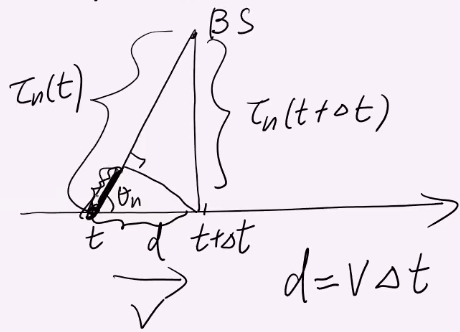

# Notes:

## Defnitions

## Review

**Tapped Delay Line Model**
$y(t) = \displaystyle \sum_{l=0}^{L-1} x(t-\frac{l}{W}) V_l(t)$

$V_l(t)$ is the time varying tap gain.

$V_l(t) = \displaystyle \sum_{n=1}^{n(t)}\alpha_n(t)e^{j\phi_n(t)} sinc(W(\tau_n-\frac{l}{W}))$

One alternative way to write this is:

$V_l(t) = \displaystyle \sum_{n=1}^{n(t)}\alpha_n(t)e^{j\phi_n(t)} sinc(\tau_n(t) \cdot W - l)$

Now we introduce the discrete time version from the book.  Section 2.2.3.

NOTE: Notation change here.

$m$ is a time index.  This is because we are sampling.

We sample at an integer multiple of our sampling time.

$\displaystyle t = \frac{m}{W}$
So our sampling period would be 
$\displaystyle T_s = \frac{1}{W}$

$h_l(m)$ is the $V_l(t)$ sampled at that time 

$y(\frac{m}{W}) = \displaystyle \sum_{l=0}^{L-1} x(\frac{m}{W}-\frac{l}{W}) V_l(\frac{m}{W})$

NOTE: Notation changess

$\displaystyle y(\frac{m}{W}) \Rightarrow y_m$

$\displaystyle x(\frac{m}{W}-\frac{l}{W}) \Rightarrow x(m-l)$

$\displaystyle V_l(\frac{m}{W}) \Rightarrow h_l(m)$

The book uses a superscript $b$ to represent the base band, and $i$ instead of $n$.

$\displaystyle h_l(m) = V_l(\frac{m}{W}) = \sum_i a_i^b(\frac{m}{W})sinc(l - \tau_i(\frac{m}{w})\cdot W )$

$\displaystyle a_i^b(\frac{m}{W}) = a_i(\frac{m}{W})e^{j\phi_i(\frac{m}{W})}$

$\displaystyle \phi_i(\frac{m}{W}) = -2\pi f_c \tau_i(\frac{m}{W})$

If you look each tap, you wonder how long it changes over time.  How fast does that change.  (related to doppler)

We are going to study the tap gain variation (over small scale where $\tau_i(\frac{m}{W})$ changes).  With a single path, the magnitude change over time.  But when there is more than one path....

## Tap Gain Variation (one path)

Dopper depends on vehicle velocity $v$, the carrier frequency $f_c$, and the angle of arrival. Consider the following:

You have a stationary base station $BS$ and a mobile receiver.  At the point $t$.  He is moving at speed $v$ in the direction of the arrow.  At some $\Delta t$ you will measure again.  At that point the time will be $t + \Delta t$.  The distance that you will have travelled is $d$ which is equal to distance * time.  $d = v\Delta t$.

Recall from the last lecture that

Frequency Shift $ = \displaystyle\frac{\phi_n(t+\Delta t) - \phi_n(t)}{(\Delta t)(2\pi)}$

So how do we calculate $\phi_n(t+\Delta t) - \phi_n(t)$  We start by using the definition of $\phi$

$\phi_n(t) = -2\pi f_c \tau_n(t)$

$\phi_n(t+\Delta t) - \phi_n(t) \implies -2\pi f_c \tau_n(t+\Delta t) - (-2\pi f_c \tau_n(t))$

In the picture above, we are moving slightly towards the base station.  Therefore the frequency will get higher.  Now we simplify and organize the above function:

$2\pi f_c (\tau_n(t) - \tau_n(t+\Delta t) )$

Because we are moving towards the base station, $\tau_n(t)$ is bigger than $\tau_n(t+\Delta t)$

When $\Delta t$ is small, we can approximate the distance by looking at the section in black.  We have a right triangle there and can use properties of the triangle to get the length of the black part.

$cos(\theta) = \frac{adjacent}{hypotenuse} \implies adjacent = hypotenuse \cdot cos(\theta)$

$\displaystyle \approx 2\pi f_c \frac{v\Delta t \cdot cos(\theta_n)}{c}$

Frequency Shift (doppler) $ = \displaystyle\frac{\phi_n(t+\Delta t) - \phi_n(t)}{(\Delta t)(2\pi)} = f_c\frac{vcos(\theta_n)}{c}$

(note we wanted the frequency in Hz which is why we times the denominator by $2\pi$.  Without that it would be the speed.)

Maximum dopler shift $f_m$ occurs when $cos(\theta) = 1$.  Therefore

$\displaystyle f_m = f_c \frac{v}{c} = \frac{v}{\lambda_c}$

Sometimes $f_c\frac{vcos(\theta_n)}{c}$ can be written as $-f_c\frac{d\tau_n(t)}{dt}$ (the derivative)  In this case the derivative of $\tau_n^{`} = -\frac{v}{c}cos(\theta_n)$

Now lets go back to the taps.  When different paths contribute to the lth tap, have different doppler shifts, the magnitude of this $h_l(m)$ changes significantly.

The doppler spread $\displaystyle D_s = max_{i,j}f_c|\tau_i^{`}-\tau_j^{`}|$ Where $\tau_i^{`}$ and $\tau_j^{`}$ are both contributing to this tap.

