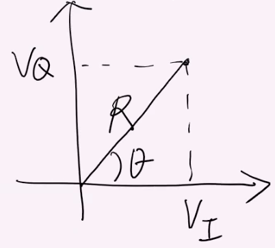

# Notes:

## Defnitions

Probability Density Function (PDF):
: The Probability Density Function (PDF) is a function that describes the probability distribution of a continuous random variable. The PDF is often denoted as $f(x)$, where (x) represents the value of the random variable.  The specific form of the equation depends on the distribution of the random variable. For example, for the standard normal distribution, the PDF is $f(x) = \frac{1}{\sqrt{2\pi}}e^\frac{x^2}{2}$  This PDF describes the shape of the classical Gaussian bell. The PDF is therefore a key tool for understanding and working with continuous random variables, allowing you to make predictions, calculate probabilities and analyze the shape of the probability distribution.

Rayleigh Fading
: We consider Rayleigh fading when there is no line of sight, but we are going to have many paths.  This is a rich scattering environment.  For example in a dense urban environment, you likely wont have LOS to the base station, but you will have lots of reflections off of the buildings reaching your mobile reciever.

Ricean Fading
: We consider is like Rayleigh fading but where you also have line of sight. We also have  many paths.  This is a rich scattering environment.  

Law of Large Numbers (LLN)
: In probability theory, the law of large numbers is a mathematical theorem that states that the average of the results obtained from a large number of independent and identical random samples converges to the true value, if it exists.  More formally, the LLN states that given a sample of independent and identically distributed values, the sample mean converges to the true mean.  The LLN is important because it guarantees stable long-term results for the averages of some random events. For example, while a casino may lose money in a single spin of the roulette wheel, its earnings will tend towards a predictable percentage over a large number of spins. Any winning streak by a player will eventually be overcome by the parameters of the game. Importantly, the law applies (as the name indicates) only when a large number of observations are considered

Normal Distribution
: $\displaystyle f(x) = \frac{1}{\sigma\sqrt{2\pi}} e^{-\frac{1}{2}(\frac{x-\mu}{\sigma})^2}$
: Can als be written as $\displaystyle f(x) = \frac{1}{\sqrt{2\pi\sigma^2}} e^{-\frac{(x-\mu)^2}{2\sigma^2}}$
: Note here that it all depends on the variable $\mu$ (the mean) and $\sigma$ which is the standard deviation.
: To simplify writing, a notation is used:  $N(\mu,\sigma^2)$, 

## Physical Modeling vs Statistical Modeling

In physical modeling you take measurements to discover the exact parameters of the channel.  This makes the process quite cumbersome.  Additionally, when the environment changes, then those parameters are no longer valid and the measurements have to be redoine.  This makes physical modeling not very useful for system design analysis.

In statistical modeling we try to capture the essential behavior of the channel.  We will use a small number of parameters.  This is to facilitate design and analysis.

So far we have talked about taps.  Remember in the flat fading case:

$y(t) = x(t)V(t)$ where 

$\displaystyle V(t) = \sum_n\alpha_n(t)e^{j\phi_n(t)}$

NOTE: Notation change.  We are going to drop the $(t)$ notation from $\alpha_n(t)$

We are going to split this out into the real $V_i(t)$  (the part with the sin) and imiaginary part $V_\theta(t)$ ( the part with the cos).

$\displaystyle V(t) = \sum_n\alpha_ncos(\phi_n(t)) + j\sum_n\alpha_nsin(\phi_n(t))$

We are going to make some assumptions here:

1: Model phase $\{\phi_n\}$ as an independent and identically distributed random variable which are uniformly distributed in the range $[0, 2\pi]$  That is that the signals are coming from all angles uniformly.
2: We assume a purely diffuse scattering environment.
3: All paths $\alpha_n \approx \frac{1}{\sqrt{N(t)}}$  That is that all paths are approximately the same signal strength.
4: Many pahts

With these assumptions we get a summation of independent and identically distributed random variables

So for Raleigh fading $V_i$ and $V_\theta$ are independent Gaussian random variables with distribution $N(0,\frac{1}{2})$  Where did we get the variance $\frac{1}{2}$ from.

Variance: $\displaystyle \int_0^{2\pi} (cos^2x)\cdot\frac{1}{2pi}dx = \frac{1}{2}$

This follows from our scale of separation where $\displaystyle \sum_{n=1}^{N(T)} \alpha_n^2 = 1$

Now we are fixing the $t$

$\displaystyle V(t) = V_i(t) + jV_Q(t)$

$R = |V_t| = \sqrt{V_i^2(T) + V_\theta^2(t)}$  

Where $R$ is the amplitude

We know that $V_I \sim N(0, \frac{1}{2})$ that is that it follows normal distribution.
We also know that $V_Q \sim N(0, \frac{1}{2})$ that is that it also follows normal distribution and is independent from $V_i$.

$\displaystyle \text{Normal distribution}\begin{cases}
    \displaystyle V_I \sim N(0, \frac{1}{2}) \\
    \displaystyle V_Q \sim N(0, \frac{1}{2})
\end{cases}$

So $(V_I, V_Q)$ is in the cartesian plane.  We are interested in the distribution of $R$ and $\theta$

$R$ is going to be independeant from $\theta$ and is going to be randomly distributued.  $\theta$ is going to be uniformly distributed from $[0, 2\pi]$.

The distribution of $R$ is called the Rayleigh Distribution.

The joint probability distribution function (PDF) is given by $f_{V_I, V_Q}(V_I, V_Q)$. Because these are indpendent variables, the joint PDF is just the product of the component PDFs. That is 

$f_{V_I, V_Q}(V_I, V_Q) = f_{V_I}(VI)\cdot f_{V_Q}(V_Q)$

Say we have a random variable $X$ that follows this random distribution $X\sim N(\mu,\sigma^2)$  Then the probability density function is $\displaystyle f_x(x) = \frac{1}{\theta\sqrt{2\pi}} e^{-\frac{1}{2}(\frac{x-\mu}{\sigma})^2}$

We are going to use these and put them all together while substituing in the $\mu=0$ and $\sigma^2\frac{1}{2}$ 
$\displaystyle f_{V_I, V_Q}(V_I, V_Q) = \frac{1}{\sqrt{2\pi\frac{1}{2}}} e^{-\frac{(V_I-0)^2}{2\frac{1}{2}}} \cdot \frac{1}{\sqrt{2\pi\frac{1}{2}}} e^{-\frac{(V_Q-0)^2}{2\frac{1}{2}}}$

This all simplifies down to 

$\displaystyle f_{V_I, V_Q}(V_I, V_Q) = \frac{1}{\pi} e^{-(V_I^2+V_Q^2)}$

**Jacobian Matrix**

How do we get to $f_{R, \theta}(r, \theta)$?  To do this we use the Jacobian approach.  We will write down the Jacobian matrix $J$ and then calculate the Jacobian determinate $det(J)$.

The transformation from polar to cartesian is given by
$\begin{cases}
   V_I = Rcos\theta \\
   V_Q = Rsin\theta
\end{cases}$

The transformation the other directoin is the jacobian matrix:

$\displaystyle \LARGE J =\begin{pmatrix}
   \frac{\partial V_I}{\partial R} & \frac{\partial V_I}{\partial \theta} \\
   \frac{\partial V_Q}{\partial R} & \frac{\partial V_Q}{\partial \theta}
\end{pmatrix} = 
\begin{pmatrix}
   cos\theta & -rsin\theta \\
   sin\theta & rcos\theta
\end{pmatrix}
$

$\displaystyle \Large |det(J)| = cos\theta\cdot rcos\theta - (-rsin\theta \cdot sin\theta) = rcos^2\theta + rsin^2\theta = r(cos^2\theta + sin^2\theta) = r$

$f_{R, \theta}(r, \theta) = f_{V_I, V_Q}(rcos\theta, rsin\theta) \cdot |det(J)| = f_{V_I, V_Q}(rcos\theta, rsin\theta) \cdot r$

This simplifies further

$f_{R, \theta}(r, \theta) = \frac{1}{\pi} e^{-(rcos\theta)^2+(rsin\theta)^2} \cdot r$

Finally we simpify to 

$\displaystyle f_{R, \theta}(r, \theta) = \frac{1}{\pi} e^{-r^2} \cdot r$

Note here that $\theta$ disapeared.  We could have not simpified quite as much and instead wrote:

$\displaystyle f_{R, \theta}(r, \theta) = \frac{1}{2\pi} 2re^{-r^2}$
where $f_\theta(\theta) = \frac{1}{2\pi}$ and $f_R(r) = 2re^{-r^2}$
Which gives our product formula:
$\displaystyle f_{R, \theta}(r, \theta) = f_\theta(\theta) \cdot f_R(r)$

When people say Rayleigh distribution, this is the one $2re^{-r^2}$

We can also calculate the separate PDFs a different way

$\displaystyle f_\theta(\theta) = \int_0^\infin f_{R, \theta}(r, \theta) dr$ 

$\displaystyle f_R(r) = \int_0^{2\pi} f_{R, \theta}(r, \theta) d\theta$ 

----

## Ricean Fading

We consider Ricean fading when we have LOS.  What is different is we are going to separate the paths into 2 parts.  One for the LOS path and one for the non-LOS paths.  We are going to use the assumptions from above.  We use the subscript of $0$ to indicate the LOS path.  The first part of the following equation is the  LOS path.  The sum represents the diffuse components.

$\displaystyle v(t) = \alpha_0 e^{j\phi_0(t)} + \sum_{n=1}^{N(t)} \alpha_n(t) e^{j\phi_n(t)}$

The question is, will the $\alpha_0$ component dominate the diffuse components.  We need parameters in order to characterize how strong the LOS path is in relation to the diffuse components.  This is the Ricean Factor

**Ricean Factor**
$\displaystyle K = \frac{\alpha_0^2}{1 - \alpha_0^2}$

If $K = 0$ then you go to the Raleigh case.

We are going to modify our above formula for $v(t)$

$\displaystyle v(t) = \alpha_0 e^{j\phi_0(t)} + \sqrt{1-\alpha_0^2}\widetilde{v}(t)$

Where $\widetilde{v}(t)$ is the diffuse part and is defined as

$\displaystyle \widetilde{v}(t) = \sum_{n=1}^{N(t)} \frac{\alpha_n}{\sqrt{1-\alpha_0^2}} e^{j\phi_n(t)}$

We did this to that it is normalized.

Now like we did in Rayleigh fading, we are going to go to polar coordinates.  It will be messier.  We start by writing down the real and imaginary parts

$\displaystyle \begin{cases}
   V_I(t) = \alpha_0 cos(\phi_0(t)) + \sqrt{1-\alpha_0^2}~\widetilde{V_I}(t) \\
   V_Q(t) = \alpha_0 sin(\phi_0(t)) + \sqrt{1-\alpha_0^2}~\widetilde{V_Q}(t)
\end{cases}$

What can we say about the distribution of $\widetilde{V_I}(t)$ and $\widetilde{V_Q}(t)$?  What kind of random variables are they?  Just like in the Raley distribution they will follow the normal distribution.  $V_I \sim N(0, \frac{1}{2})$ and $V_Q \sim N(0, \frac{1}{2})$

Like before we want to go from $(V_I, V_Q) \Rightarrow (R, \theta)$ and will need to use the Jacobian to do it.  The big difference here is the line of sight.  It complicates things.  To simplify the problem, we will assume that $\phi_0$ (the angle of the LOS path) is known.  When we get through this all we will find that the conditional PDF for $R,\theta$ is not dependant on $\phi_0$.

What can we now say about the distribution of $V_I(t)$  It no longer has 0 mean like it did in the Rayliegh case becasue the expected value of the summation of 2 random variables always = the sum of the expected values.

$E(X+Y) = E(X) + E(Y)$

Here the Y part is the Rayleigh part which has distribution of $N[0,\frac{1}{2}]$, but the first part has a different $\mu$ that is non-zero.

So, $\displaystyle \LARGE V_{I_{|\phi_0}}$ means $V_I$ for a given $\phi_0$

From the defnition of variance

$var(aX) = a^2var(x)$

$\displaystyle \text{Normal distribution for a given }\phi_0\begin{cases}
    \displaystyle V_{I_{|\phi_0}} \sim N(\alpha_0cos\phi_0(t), \frac{1}{2}(\sqrt{1-\alpha_0^2})) \\
    \displaystyle V_{I_{|\phi_0}} \sim N(\alpha_0sin\phi_0(t), \frac{1}{2}(\sqrt{1-\alpha_0^2}))
\end{cases}$

Now we go into the jacobian.

Recall from above that if we have a random variable $X$ that follows this random distribution $X\sim N(\mu,\sigma^2)$  Then the probability density function is $\displaystyle f(x) = \frac{1}{\sqrt{2\pi\sigma^2}} e^{-\frac{(x-\mu)^2}{2\sigma^2}}$ 

We are also going to use the trignometric identity $\cos(x + yY) = \cos(x)\cos(y)+\sin(x)\sin(y)$

Now for the derivation.

$$\displaystyle \begin{equation}
\begin{split}
   f_{R, \theta_{|\phi_0}}(r, \theta) &= f_{V_I, V_{Q_{|\phi_0}}}(rcos\theta, rsin\theta)  \cdot r\\
     &= f_{V_I, V_{Q_{|\phi_0}}}(rcos\theta) \cdot f_{V_I, V_{Q_{|\phi_0}}}(rsin\theta) \cdot r \\
     &= \frac{1}{\sqrt{2\pi(\frac{1-\alpha_0^2}{2})}} e^{-\frac{(rcos\theta-\alpha_0cos\theta_0)^2}{2(\frac{1-\alpha_0^2}{2})}} \cdot \frac{1}{\sqrt{2\pi(\frac{1-\alpha_0^2}{2})}} e^{-\frac{(rsin\theta-\alpha_0sin\theta_0)^2}{2(\frac{1-\alpha_0^2}{2})}} \cdot r \\
     &= \frac{r}{\pi(1-\alpha_0^2)} e^{-\frac{r^2 + \alpha_0^2 - 2r\alpha_0(cos\theta cos\phi_0 + sin\theta sin\phi_0)}{1-\alpha_0^2}} \\
     &= \frac{r}{\pi(1-\alpha_0^2)} e^{-\frac{r^2+\alpha_0^2}{1-\alpha_0^2}} e^{\frac{2r\alpha_0}{1-\alpha_0^2}cos(\theta - \phi_0)}
\end{split}
\end{equation}$$

Once we have the joint PDF we are going to proceed to calculate the marginal.  To get the marginal PDF we need to average over $\theta$ to get $f_R(r)$

$I_0(x) \int_0^{2\pi}  e^{xcos\theta} d\theta$ is the "zeroth order modified bessel function of the 1st kind".  We will do some funkyness in the following to get to that form.

$$\displaystyle \begin{equation}
\begin{split}
    f_R(r) &= \int_0^{2\pi} f_{R, \theta_{|\phi_0}}(r, \theta) d\theta \\
           &= \int_0^{2\pi} \frac{r}{\pi(1-\alpha_0^2)} e^{-\frac{r^2+\alpha_0^2}{1-\alpha_0^2}} e^{\frac{2r\alpha_0}{1-\alpha_0^2}cos(\theta - \phi_0)} d\theta \\
           &= \frac{r}{\pi(1-\alpha_0^2)} e^{-\frac{r^2+\alpha_0^2}{1-\alpha_0^2}} \int_0^{2\pi}  e^{\frac{2r\alpha_0}{1-\alpha_0^2}cos(\theta - \phi_0)} d\theta \\
           &= \frac{2r}{(1-\alpha_0^2)} e^{-\frac{r^2+\alpha_0^2}{1-\alpha_0^2}} \frac{1}{2\pi} \int_0^{2\pi}  e^{\frac{2r\alpha_0}{1-\alpha_0^2}cos(\theta - \phi_0)} d\theta \\
           &= \frac{2r}{(1-\alpha_0^2)} e^{-\frac{r^2+\alpha_0^2}{1-\alpha_0^2}} I_0(\frac{2r\alpha_0}{1-\alpha_0^2}) \\
\end{split}
\end{equation}$$

In the step where we dropped the $cos(\theta-\phi_0) \Rightarrow cos(\theta)$ we were integrating theta from $0-2\pi$ which is a full circle.  By rotating by $\theta$, we still have a full circle so we have a minor change of variable here.

----

We want to use matlab to simulate a time varying fading channel.  So how should we do that.

Lets assume $N=16$ and $\alpha_n = \frac{1}{\sqrt{N}}$

$\displaystyle V(t) = \sum_{n=1}^N \alpha_n e^{j\phi_n(t)}$

How do we generate the time varying phase shift $\phi_n(t)$.

$\widehat{\phi_n}$ we indidcates we are now doing a simulation of $\phi_n$.  For each phase you must randomly pick (between $[0,2\pi$ as an initial phase $\psi_n$.  The time varying part 

$\widehat{\phi_n} = \psi_n - 2\pu f_m \cos\theta_n(t)$

Here $\theta_n = \frac{2\pi n}{N} ~~~~~\text{where} N=0,1,2,...,N-1$
We assume that these are evenly spaced angles.

